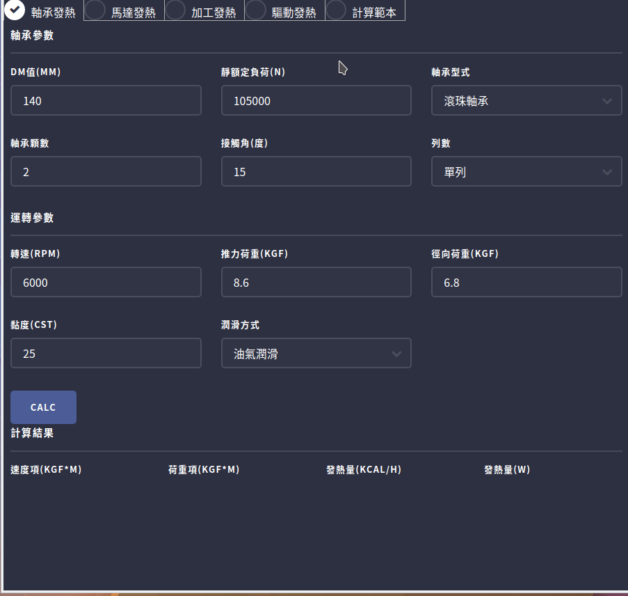
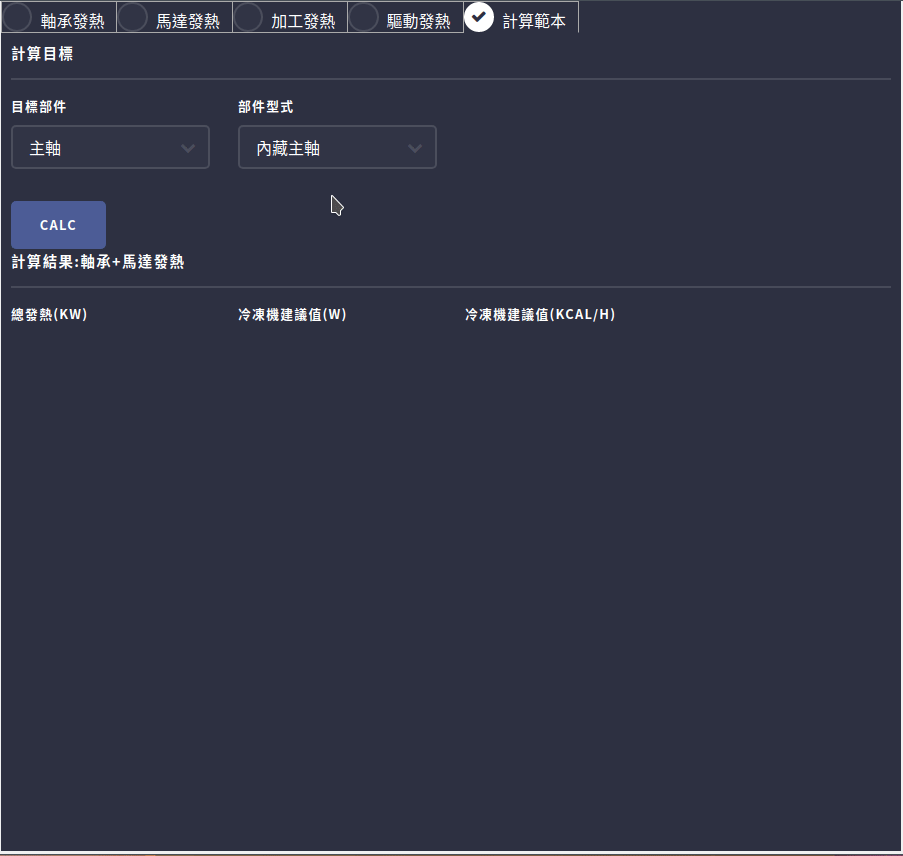
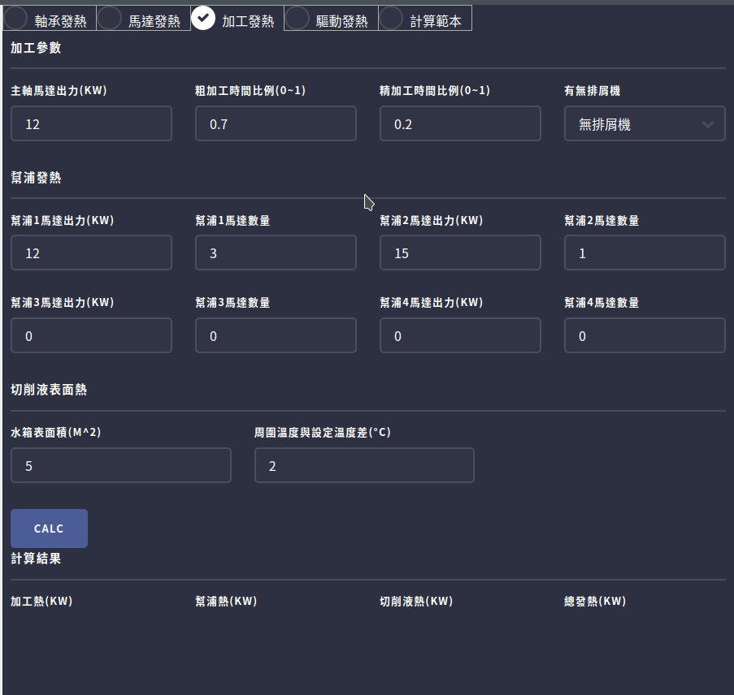

# Machine_Heat

## 說明

### 軸承發熱

- 可使用於計算螺桿或是主軸等情況下使用軸承時軸承的發熱量

### 馬達發熱

- 根據馬達的型式及功率計算馬達的發熱量

### 加工發熱

- 根據主軸與加工時間比例去計算加工時的發熱  
- 水箱內幫浦的發熱也一併計算其中,目前最多可以輸入四種不同功率的幫浦
- 切消液水箱本身也會吸熱,因此也需要算入

### 驅動發熱

- 計算螺桿與導軌的發熱,導軌可以選擇硬軌或線軌

### 計算範本

- 目前有主軸與螺桿兩種計算範本
- 主軸有分成內藏馬達與非內藏,根據選擇最終的總發熱量會有所不同  
- 螺桿有分成是否需要計算馬達與螺桿連結介面的傳導熱
- 若是要計算的數值有缺少參數會提醒

### 基本錯誤回報功能

## 程式架構

├── coolant　//文件,切削液發熱頁面用  
│　　　　├── tcoolant　//物件 用於計算切削液發熱  
│　　　　├── tpump //物件 用於計算幫浦發熱  
│　　　　└── tworker //物件 用於計算加工發熱  
├── motor //物件,用於計算馬達發熱  
├── moving //文件,驅動發熱頁面用  
│　　　　├── Tballscrew //物件 用於計算螺桿發熱  
│　　　　├── Tguide //物件 用於計算線軌發熱  
│　　　　└── Tmoving //物件 用於儲存移動體參數,包含螺桿及線軌發熱  
├── opera //文件,軸承發熱頁面用  
│　　　　├── Bearing //物件 儲存軸承參數  
│　　　　├── calc //方法 計算發熱量
│　　　　├── result //物件 儲存計算結果  
│　　　　├── show //方法 將結果顯示到頁面上  
│　　　　├── topera //物件 整合軸承與加工  
│　　　　└── Work //物件 儲存加工參數  
├── save //文件,參數儲存與讀取的方法  
└── UI //lorca的框架

## Version

### Unlease

- 儲存現有參數

### [1.0.1] 2020.04.21

#### ADD

- ReadMe新增程式架構

### [1.0.0] 2020.04.07

- 軸承發熱
- 馬達發熱
- 加工發熱
- 驅動發熱
- 計算範本

> 以上功能完成
